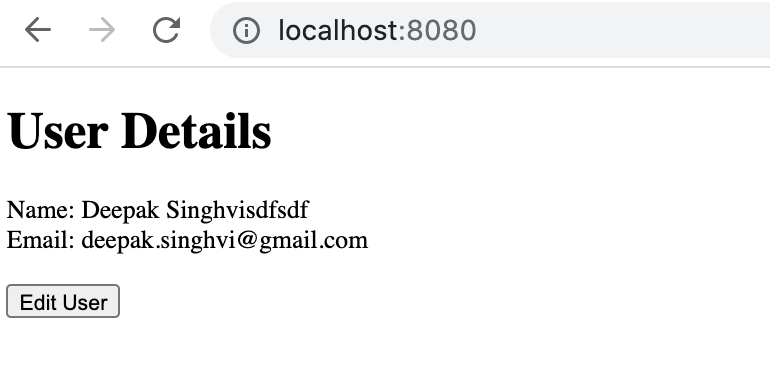

# GO Web Application Demo
Sample Web Application Build in GoLang and Templates

### Create Build Run
```

mkdir goweb
cd goweb

#create go module
go mod init github.com/deepaksinghvi/goweb

#if not installed cobra library than do the following
go get -u github.com/spf13/cobra/cobra

#initiate cobra cli
cobra init --pkg-name  github.com/deepaksinghvi/goweb

#build/install
go install github.com/deepaksinghvi/goweb

$goweb
```

### Try it out
http://localhost:8080




